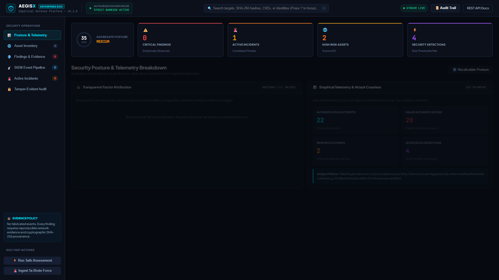
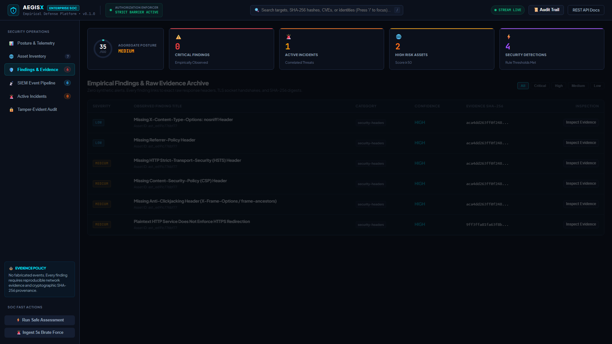
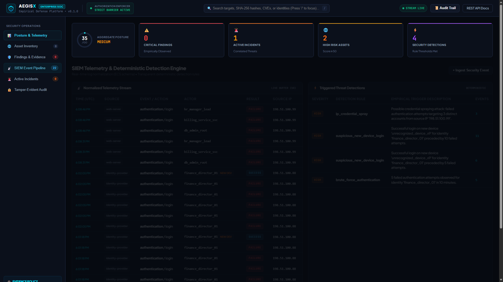
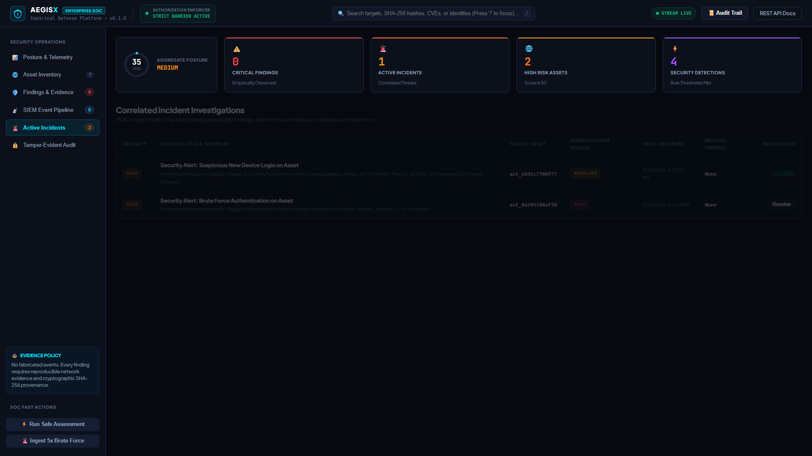
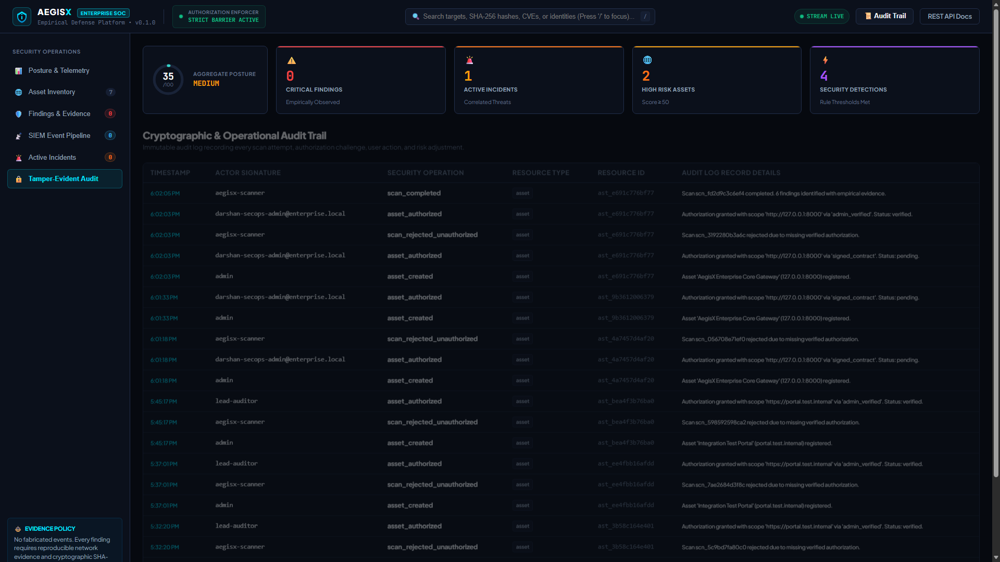
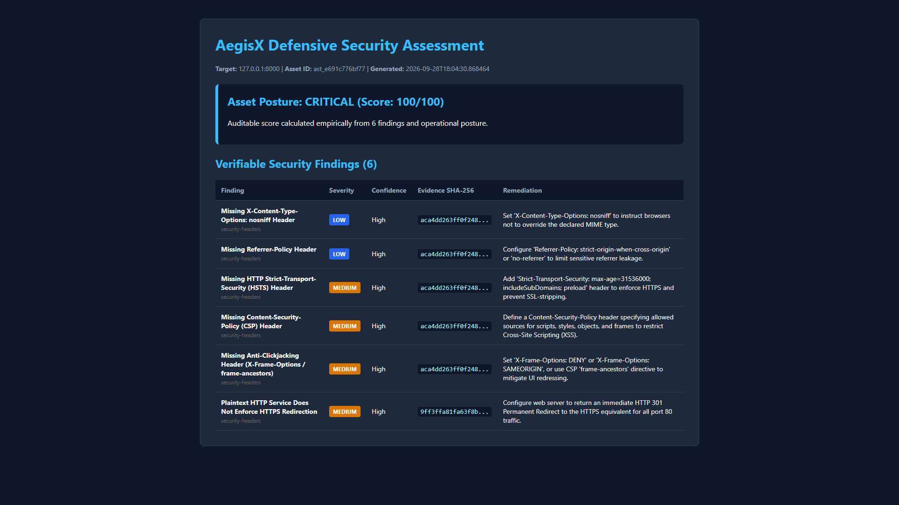

# Empirical Cyber Defense & Telemetry Platform (AegisX)

> **"Zero Fabricated Events. Cryptographically Verifiable Defense."**

An enterprise-grade defensive cybersecurity platform that combines non-destructive vulnerability assessment, an enforced authorization barrier, and real-time SIEM log correlation with strict SHA-256 evidence provenance.

---

## Visual Proof of Concept (Live Running Platform)

> **Authenticity Note**: All screenshots were captured directly from a live running AegisX instance (`http://127.0.0.1:8000`) evaluating live HTTP probes and streaming SIEM telemetry. **No synthetic mocks or AI image generators were used.**

| Enterprise SOC Command Center | Verifiable Findings & SHA-256 Provenance |
| :---: | :---: |
| [](docs/proof-of-concept.md#1-enterprise-soc-command-center-telemetry-hud--threat-matrix) | [](docs/proof-of-concept.md#2-verifiable-empirical-findings--cryptographic-evidence-ledger) |
| *Real-time Posture Arc Gauge & Threat HUD* | *Every finding backed by raw headers & SHA-256 hash* |

| SIEM Telemetry & Detection Pipeline | Incident Response & Investigation War Room |
| :---: | :---: |
| [](docs/proof-of-concept.md#3-siem-telemetry-stream--real-time-rule-detections) | [](docs/proof-of-concept.md#4-incident-response-war-room--investigation-lifecycle) |
| *ECS-normalized authentication event streams* | *Correlated threats, status tracking & playbooks* |

| Tamper-Evident Cryptographic Audit Ledger | Executive Compliance & Security Report |
| :---: | :---: |
| [](docs/proof-of-concept.md#5-cryptographic-tamper-evident-audit-ledger) | [](docs/proof-of-concept.md#6-executive-security-audit--compliance-report) |
| *Immutable trail of authorizations, scans & triage* | *Verifiable executive audit report with evidence hashes* |

📖 **For detailed empirical verification steps, attack simulations, and mathematical proof breakdowns, read the full [Proof of Concept Technical Report](docs/proof-of-concept.md).**

---

## Core Pillars & Architectural Principles

### 1. No Invented Security Events
Unlike traditional scanners that output theoretical alert summaries or proprietary probabilistic guesswork, AegisX binds every single finding directly to raw wire captures:
* **Empirical Response Headers**: Preserves the exact status line and HTTP headers observed during live network probes.
* **Cryptographic SHA-256 Provenance**: Calculates a deterministic hash over the canonical network capture, creating a tamper-evident audit record.
* **Non-Destructive OWASP Auditing**: Evaluates TLS/SSL certificate chains, protocol configurations, and critical security headers (HSTS, CSP, X-Frame-Options, cookie flags) without service disruption.

### 2. Mandatory Authorization Barrier
The scanning engine strictly enforces an authorization gate before dispatching any TCP handshakes or HTTP requests:
* **Zero Probing Without Consent**: Scans against targets lacking active, verified authorization records are immediately aborted (`rejected_unauthorized`) with 0 packets transmitted.
* **Verification Mechanisms**: Supports signed penetration testing agreements, admin verification tokens, and DNS TXT challenges.

### 3. Deterministic SIEM & Threat Correlation
* **ECS-Aligned Event Model**: Normalizes heterogeneous logs from identity providers, web servers, endpoint agents, and firewalls.
* **Threshold Detection Rules**: Implements high-fidelity, deterministic rules (e.g. 5 failed authentications within a 10-minute window, anomalous new-device logins after failure bursts).
* **Automated Incident Correlation**: Links detection anomalies to active vulnerability findings on the target asset, eliminating alert fatigue.

### 4. Transparent Mathematical Risk Scoring
Replaces proprietary black-box "magic numbers" with an auditable scoring ledger:
$$\text{Risk Score} = \text{Baseline (10)} + \sum \Delta_{\text{Exposure}} + \sum \Delta_{\text{Findings}} + \sum \Delta_{\text{Incidents}} - \sum \Delta_{\text{Compensating Controls}}$$
Every point addition ($+25$ critical vulnerability, $+10$ production exposure) and subtraction ($-5$ compensating CSP control) is documented with an auditable rationale.

---

## System Architecture

```
                          ┌────────────────────────┐
                          │  AegisX Web Dashboard  │
                          │   & REST API Clients   │
                          └───────────┬────────────┘
                                      │
                         ┌────────────▼────────────┐
                         │   FastAPI Core Gateway  │
                         │    (/api/v1 endpoints)  │
                         └────────────┬────────────┘
                                      │
       ┌──────────────────────────────┼──────────────────────────────┐
       │                              │                              │
┌──────▼──────┐               ┌───────▼───────┐              ┌───────▼───────┐
│ Asset & Auth│               │ Safe Scanner  │              │ SIEM Event    │
│ Service     │               │ Engine        │              │ Ingestion     │
└──────┬──────┘               └───────┬───────┘              └───────┬───────┘
       │                              │                              │
       │ (Mandatory Gate)             │ (Empirical Checks)           │ (ECS Schema)
       │ Verified or Abort            ├── TLS/SSL Chains             │ Normalized
       │                              ├── Security Headers           │
       │                              └── SHA-256 Provenance         │
       │                              │                              │
       └──────────────────────────────┼──────────────────────────────┘
                                      │
                            ┌─────────▼─────────┐
                            │ Detection Engine  │ (Deterministic Rules)
                            └─────────┬─────────┘
                                      │
                            ┌─────────▼─────────┐
                            │Correlation Engine │ (Correlates Findings & Alerts)
                            └─────────┬─────────┘
                                      │
                            ┌─────────▼─────────┐
                            │Auditable Risk Eng │ (Explainable +/- Factor Deltas)
                            └───────────────────┘
```

---

## Quickstart & Local Deployment

### Prerequisites
* Python 3.10+ (Tested on Python 3.12)
* Git

### 1. Installation
```powershell
git clone https://github.com/DarshanM0022/Empirical-Cyber-Defense-Telemetry-Platform.git
cd Empirical-Cyber-Defense-Telemetry-Platform
python -m pip install -r requirements.txt
```

### 2. Start Platform Server
```powershell
python -m uvicorn backend.app.main:app --host 127.0.0.1 --port 8000
```

### 3. Access Live Web Console & Docs
* **Interactive SOC Command Center**: [http://127.0.0.1:8000/](http://127.0.0.1:8000/)
* **OpenAPI / Swagger REST Documentation**: [http://127.0.0.1:8000/docs](http://127.0.0.1:8000/docs)
* **Health Verification**: [http://127.0.0.1:8000/api/v1/health](http://127.0.0.1:8000/api/v1/health)

### 4. Run Automated Proof of Concept & Attack Simulations
```powershell
# Ingest baseline empirical scan & authentication logs
python scripts/populate_poc_data.py

# Ingest advanced credential spray, incident lifecycle, & cryptographic SHA-256 verification
python scripts/run_advanced_poc.py
```

### 5. Run Automated Test Suite
```powershell
python -m pytest -v
```
All 8 integration tests execute against real sockets, live local HTTP servers, and empirical telemetry without mocks.

---

## Containerized Deployment (Docker Compose)
```powershell
docker-compose up --build
```

---

## In-Depth Documentation & Learning Guides
* 📄 **[Download Beginner's Guide (PDF)](AegisX_Beginners_Guide_Empirical_Cyber_Defense.pdf)** — *A comprehensive guide written for beginners and non-experts to easily understand and explain this project.*
* 🌐 **[Beginner's Guide (HTML Interactive View)](docs/AegisX_Beginners_Guide.html)**
* 📖 [Proof of Concept (POC) Technical Walkthrough](docs/proof-of-concept.md)
* 🏗️ [System Architecture Specification](docs/architecture.md)
* 🔬 [Safe Scanner Methodology (OWASP WSTG Aligned)](docs/scanner-methodology.md)
* ⚖️ [Transparent Risk Model & Mathematical Formulation](docs/risk-model.md)
* 🧪 [Testing Guide (Real-World Testing Standards)](docs/testing-guide.md)

---

## License
Apache License 2.0. Built for ethical defensive cybersecurity engineering and authorized compliance assessment.
