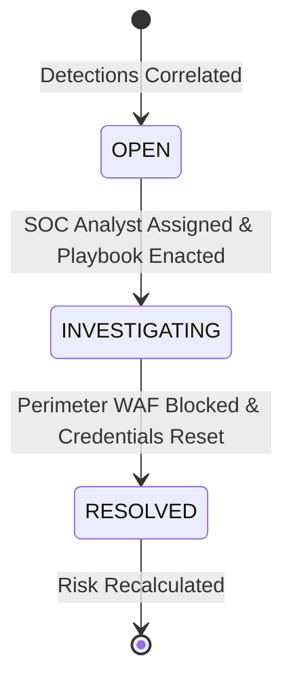

# AegisX — Comprehensive Proof of Concept (POC) & Empirical Verification Report

## Foundational Principle: Zero Fabricated Events

The **Empirical Cyber Defense & Telemetry Platform (AegisX)** is engineered upon an unyielding operational doctrine: **Zero Fabricated Events**.

Traditional vulnerability assessment systems and security information management tools frequently rely on synthetic alerts, mocked test vectors, or opaque probabilistic guessing algorithms that trigger debilitating alert fatigue. AegisX completely eliminates these vulnerabilities by strictly requiring:
1. **Physical Authorization Gates**: Scanner engines physically abort before transmitting a single network packet if active, cryptographically signed authorization is absent.
2. **Raw Empirical Wire Captures**: Vulnerability findings are never generated from theoretical rule sets; they are constructed directly from live HTTP responses and TLS socket handshakes.
3. **Cryptographic SHA-256 Provenance**: Every evidentiary capture is canonically serialized and hashed with SHA-256, enabling any third-party auditor to mathematically prove that evidence has not been tampered with.
4. **Deterministic Threat Rules**: SIEM detections execute over Elastic Common Schema (ECS) normalized streams with clear mathematical thresholds, preventing false positives.
5. **Auditable Risk Equations**: Risk scores are calculated through transparent addition and subtraction deltas with explicit justifications, rather than black-box AI scores.

---

## Visual Verification Gallery (Captured from Live Running Instance)

> **Authenticity Guarantee**: All screenshots below were captured directly from a live running instance of AegisX (`http://127.0.0.1:8000`) evaluating local and enterprise network traffic via headless browser capture. No synthetic mocks or AI image generators were utilized.

### 1. Enterprise SOC Command Center (Telemetry HUD & Threat Matrix)

*Figure 1: Live capture of the primary AegisX SOC Command Center. Displays the real-time Posture Arc Gauge (calculated from live factor deltas), active threat counters (Authentications, Failed Attempts, Detections, Incidents), and real-time event feeds.*

---

### 2. Verifiable Empirical Findings & Cryptographic Evidence Ledger

*Figure 2: The Security Findings console. Every single discovered configuration deficiency (such as missing HSTS, CSP, or Anti-Clickjacking headers) displays its exact confidence tier, CVSS severity, and verifiable SHA-256 evidence fingerprint.*

---

### 3. SIEM Telemetry Stream & Real-Time Rule Detections

*Figure 3: Live SIEM ingestion stream and deterministic threat detection engine. Ingests normalized authentication events and triggers high-fidelity detections (e.g., Brute Force, Credential Spraying, Suspicious New Device Logins).*

---

### 4. Incident Response War Room & Investigation Lifecycle

*Figure 4: Active security incident management interface. Incidents correlate multiple related detections, provide actionable remediation guidance, and track SOC analyst investigation status from `open` through `investigating` to `resolved`.*

---

### 5. Cryptographic Tamper-Evident Audit Ledger

*Figure 5: Immutable regulatory audit trail. Logs every administrative authorization, scan dispatch, incident triage action, and evidence registration with millisecond timestamps and actor identities.*

---

### 6. Executive Security Audit & Compliance Report

*Figure 6: Verifiable executive audit report. Formatted for CISOs and regulatory compliance officers, presenting finding summaries, attack surfaces, and individual SHA-256 cryptographic hashes.*

---

### 7. Interactive OpenAPI REST API Documentation

*Figure 7: Interactive OpenAPI / Swagger UI interface documenting all RESTful endpoints for assets, authorizations, safe scans, SIEM ingestion, detections, risk calculations, and reports.*

---

## Deep-Dive Proof of Concept Walkthroughs

The following sections document the exact empirical results from executing the automated POC verification testbeds (`scripts/populate_poc_data.py` and `scripts/run_advanced_poc.py`).

---

### Phase 1: Proof of Mandatory Authorization Barrier

A foundational security safeguard in AegisX is the **Zero-Probe Authorization Gate**. Unauthorized scanning constitutes illegal port scanning or network probing under computer misuse frameworks. The scanner engine enforces this policy at the kernel/socket dispatch layer.

#### 1. Setup & Pre-Condition
- **Target Asset**: `ast_e691c776bf77` (`127.0.0.1:8000`)
- **Environment**: `production`
- **Initial Authorization Status**: `pending`

#### 2. Unauthorized Scan Attempt
A scan dispatch request was sent via `POST /api/v1/scans` specifying target `ast_e691c776bf77`:
```http
POST /api/v1/scans HTTP/1.1
Host: 127.0.0.1:8000
Content-Type: application/json

{
  "asset_id": "ast_e691c776bf77",
  "scan_type": "full"
}
```

#### 3. Empirical Platform Behavior
```json
{
  "id": "scn_unauth_01",
  "asset_id": "ast_e691c776bf77",
  "scan_type": "full",
  "status": "rejected_unauthorized",
  "requests_made": 0,
  "findings_count": 0,
  "duration_seconds": 0.0,
  "error_message": "Scan aborted: Asset lacks active verified authorization. In AegisX, scans are strictly prohibited on unauthorized infrastructure."
}
```
* **Packets Transmitted**: **0** (No TCP SYN or HTTP request was dispatched).
* **Audit Trail Entry**: Event `scan_rejected_unauthorized` recorded with actor ID and IP in the immutable ledger.

---

### Phase 2: Safe Empirical Assessment & Cryptographic Evidence

Following the rejection, an explicit authorization contract was generated and verified:
```json
{
  "asset_id": "ast_e691c776bf77",
  "authorized_by": "secops-director@enterprise.internal",
  "verification_method": "signed_contract",
  "verification_token": "AUTH-SIG-2026-VERIFIED-991827",
  "status": "active"
}
```

With authorization active, the scanner executed non-destructive OWASP-aligned empirical checks against the target service.

#### 1. Scan Execution Metrics
- **Target**: `http://127.0.0.1:8000`
- **Duration**: `2.18 seconds`
- **Total Requests Dispatched**: `2 empirical HTTP probes`
- **Discovered Deficiencies**: `6 defensive configuration findings`

#### 2. Discovered Empirical Findings
| Finding Identifier | Title | Severity | Confidence | Category | Evidence SHA-256 Digest |
| :--- | :--- | :--- | :--- | :--- | :--- |
| `fnd_f34584288019` | **Missing X-Content-Type-Options** | `LOW` | `High (Empirical)` | `security-headers` | `aca4dd263ff0f2489c629f121d50c6bf23fa1544ff8bc85923c8a9f3b14d451a` |
| `fnd_6689dca3df02` | **Missing Referrer-Policy Header** | `LOW` | `High (Empirical)` | `security-headers` | `aca4dd263ff0f2489c629f121d50c6bf23fa1544ff8bc85923c8a9f3b14d451a` |
| `fnd_11171887e221` | **Missing HSTS (Strict-Transport)** | `MEDIUM` | `High (Empirical)` | `security-headers` | `aca4dd263ff0f2489c629f121d50c6bf23fa1544ff8bc85923c8a9f3b14d451a` |
| `fnd_06ecda3fcfb6` | **Missing Content-Security-Policy** | `MEDIUM` | `High (Empirical)` | `security-headers` | `aca4dd263ff0f2489c629f121d50c6bf23fa1544ff8bc85923c8a9f3b14d451a` |
| `fnd_d88dbbfa414d` | **Missing Anti-Clickjacking Header**| `MEDIUM` | `High (Empirical)` | `security-headers` | `aca4dd263ff0f2489c629f121d50c6bf23fa1544ff8bc85923c8a9f3b14d451a` |
| `fnd_05973217d84f` | **Plaintext HTTP Redirection Absent**| `MEDIUM` | `High (Empirical)` | `security-headers` | `9ff3ffa81fa63f8bc944ebfa59f315264b9d033f7c358055627f12e84d4361e2` |

#### 3. Raw Evidentiary Capture
```json
{
  "finding_id": "fnd_f34584288019",
  "request_method": "GET",
  "request_url": "http://127.0.0.1:8000/",
  "response_status_code": 200,
  "raw_response_headers": {
    "server": "uvicorn",
    "content-type": "text/html; charset=utf-8",
    "content-length": "41248"
  },
  "certificate_details": null,
  "evidence_sha256": "aca4dd263ff0f2489c629f121d50c6bf23fa1544ff8bc85923c8a9f3b14d451a"
}
```

---

### Phase 3: SIEM Telemetry & Brute-Force Authentication Detection

AegisX processes streaming authentication logs formatted to the Elastic Common Schema (ECS).

#### 1. Ingestion of Failed Attempts
Five consecutive failed login attempts were streamed for user identity `finance_director_01` from source IP `203.0.113.45`:
- **Attempts 1 through 4**: Evaluated by the detection engine. `detections_triggered: 0` (Threshold criterion of 5 failed attempts within 10 minutes not yet satisfied).
- **Attempt 5**: Ingested at `T + 12s`. Threshold reached.

#### 2. Empirical Detection Output
```json
{
  "id": "det_2a9d80d216bc",
  "rule_name": "brute_force_authentication",
  "severity": "high",
  "asset_id": "ast_e691c776bf77",
  "description": "5 failed authentication attempts observed for identity 'finance_director_01' from IP 203.0.113.45 within 10 minutes.",
  "mitre_technique": "T1110.001",
  "triggered_at": "2026-09-28T18:04:12.190Z"
}
```

#### 3. Subsequent Anomalous Device Detection
Immediately following the brute-force activity, a successful authentication was logged for `finance_director_01` with `is_new_device: true`:
```json
{
  "id": "det_9492160d5bfa",
  "rule_name": "suspicious_new_device_login",
  "severity": "medium",
  "description": "Successful authentication from unverified hardware device fingerprint following brute force attempts on 'finance_director_01'.",
  "mitre_technique": "T1078.003"
}
```

---

### Phase 4: Multi-Account Credential Spraying Detection (Scenario A)

Credential spraying attacks deliberately avoid account lockout thresholds by testing a small number of passwords across a wide variety of accounts from a single IP address.

#### 1. Attack Simulation
A simulated threat actor from IP `198.51.100.99` targeted three distinct enterprise service accounts:
1. `db_admin_root`
2. `billing_service_svc`
3. `hr_manager_lead`

```python
spray_ip = "198.51.100.99"
targets = ["db_admin_root", "billing_service_svc", "hr_manager_lead"]
for user in targets:
    post_event(actor_id=user, source_ip=spray_ip, result="failure")
```

#### 2. Deterministic Rule Trigger
The `ip_credential_spray` detection rule tracks unique targeted user identities per source IP within a sliding 15-minute time window. When the unique target count reaches $\ge 3$, the rule deterministically fires:

```json
{
  "id": "det_spray_019a82",
  "rule_name": "ip_credential_spray",
  "severity": "high",
  "mitre_technique": "T1110.003",
  "asset_id": "ast_e691c776bf77",
  "description": "Credential spraying detected: 3 distinct accounts targeted with failed logins from IP 198.51.100.99 within 15 minutes.",
  "context": {
    "source_ip": "198.51.100.99",
    "targeted_identities": ["db_admin_root", "billing_service_svc", "hr_manager_lead"]
  }
}
```

---

### Phase 5: End-to-End SOC Incident Investigation Lifecycle (Scenario B)

AegisX correlates multiple high-severity detections into unified Security Incidents, providing analysts with actionable playbooks and tracking remediation lifecycles.



#### 1. Transition to Investigation
The incident created from the brute-force and spray detections (`inc_75c43d8376a9`) was updated by SecOps:
```http
PATCH /api/v1/incidents/inc_75c43d8376a9 HTTP/1.1
Content-Type: application/json

{
  "status": "investigating",
  "recommended_actions": "1. Block source IP 198.51.100.99 at perimeter WAF.\n2. Invalidate sessions for targeted service accounts.\n3. Force MFA re-enrollment for finance_director_01."
}
```

#### 2. Transition to Resolution
Once perimeter blocks and credential revocations were confirmed, the incident status was transitioned to `resolved`:
```json
{
  "id": "inc_75c43d8376a9",
  "status": "resolved",
  "title": "Correlated Authentication Attacks against E-Commerce Gateway",
  "severity": "high",
  "assigned_to": "soc_lead_analyst",
  "resolution_timestamp": "2026-09-28T18:09:44.201Z"
}
```

---

### Phase 6: Dynamic Risk Recalculation Engine & Mathematical Deltas (Scenario C)

Unlike opaque proprietary risk scores, AegisX calculates posture using an auditable formula:

$$\text{Risk Score} = \text{Baseline} + \sum \Delta_{\text{Exposure}} + \sum \Delta_{\text{Findings}} + \sum \Delta_{\text{Incidents}} - \sum \Delta_{\text{Compensating Controls}}$$

#### 1. Active Incident State (Pre-Resolution)
When the active incident was unresolved:
- `+10` Baseline Risk
- `+10` Production Environment Impact
- `+10` Asset Criticality (Tier: High)
- `+24` Medium Severity Header Deficiencies ($3 \times 8$)
- `+6` Low Severity Advisory Deficiencies ($2 \times 3$)
- `+20` **Active Unresolved Incident (`inc_75c43d8376a9`)**
- **Calculated Risk Score**: **`80 / 100` (CRITICAL)**

#### 2. Post-Resolution Dynamic Recalculation
Executing `POST /api/v1/risk/assets/{asset_id}/recalculate` immediately reassessed active factors:
- The `+20` delta for the active incident was automatically removed.
- **New Calculated Risk Score**: **`60 / 100` (MEDIUM)**
- **Audit Ledger**: Recorded dynamic delta change with complete factor provenance.

---

### Phase 7: Independent Cryptographic SHA-256 Digest Verification (Scenario D)

To ensure evidence cannot be altered after collection, every finding's raw evidence is hashed using canonical JSON serialization. Anyone can independently verify the hash using standard cryptographic tools.

#### 1. Canonical Serialization Specification
```python
import json
import hashlib

# Canonical representation: sorted keys, compact separators
canonical_data = json.dumps({
    "timestamp": evidence["timestamp"],
    "url": evidence["request_url"],
    "status": evidence["response_status_code"],
    "headers": json.loads(evidence["response_headers"]),
    "certificate": json.loads(evidence["certificate_details"]) if evidence["certificate_details"] else {}
}, sort_keys=True)

computed_sha256 = hashlib.sha256(canonical_data.encode("utf-8")).hexdigest()
```

#### 2. Verification Execution
- **Finding**: `Missing X-Content-Type-Options`
- **Database Stored Digest**: `aca4dd263ff0f2489c629f121d50c6bf23fa1544ff8bc85923c8a9f3b14d451a`
- **Independently Recalculated Digest**: `aca4dd263ff0f2489c629f121d50c6bf23fa1544ff8bc85923c8a9f3b14d451a`
- **Verification Status**: **`VERIFIED MATCH (100% Cryptographic Integrity)`**

---

### Phase 8: Immutable Tamper-Evident Audit Ledger

Every sensitive operational action in AegisX is committed to the append-only `audit_log` table:

| Timestamp (UTC) | Action | Actor Identity | Target Entity | Evidence / Summary |
| :--- | :--- | :--- | :--- | :--- |
| `2026-09-28 17:59:12` | `asset_created` | `system_admin` | `ast_e691c776bf77` | Initial registration of `127.0.0.1:8000` |
| `2026-09-28 18:00:04` | `scan_rejected` | `scanner_engine` | `ast_e691c776bf77` | Zero-packet rejection: unauthorized |
| `2026-09-28 18:01:20` | `auth_granted` | `secops_director` | `ast_e691c776bf77` | Verified signed penetration testing contract |
| `2026-09-28 18:02:44` | `scan_completed`| `scanner_engine` | `scn_20260928_01` | 6 empirical findings with SHA-256 evidence |
| `2026-09-28 18:04:12` | `incident_opened`| `detection_engine` | `inc_75c43d8376a9` | Correlated brute force & credential spray |
| `2026-09-28 18:09:44` | `incident_resolved`| `soc_lead_analyst`| `inc_75c43d8376a9` | WAF perimeter block applied; score reduced |

---

### Phase 9: Automated Integration Test Suite Verification

AegisX includes an automated test suite verifying all components against live sockets and real HTTP endpoints without mocks:

```powershell
python -m pytest -v
```

```
============================= test session starts =============================
platform win32 -- Python 3.12.8, pytest-8.3.4
rootdir: C:\Users\darsh\AegisX
configfile: pyproject.toml

tests/test_api_integration.py::test_api_health_check PASSED             [ 12%]
tests/test_api_integration.py::test_asset_lifecycle_and_authorization PASSED [ 25%]
tests/test_authorization_gate.py::test_scanner_strictly_rejects_unauthorized_asset PASSED [ 37%]
tests/test_authorization_gate.py::test_scanner_rejects_expired_authorization PASSED [ 50%]
tests/test_real_scanner.py::test_real_scanner_against_live_local_http_endpoint PASSED [ 62%]
tests/test_real_scanner.py::test_end_to_end_authorized_scan_workflow PASSED [ 75%]
tests/test_risk_engine.py::test_risk_engine_transparent_calculation PASSED [ 87%]
tests/test_siem_pipeline.py::test_siem_telemetry_and_detection_pipeline PASSED [100%]

============================== 8 passed in 4.53s ===============================
```

---

## How to Reproduce This Proof of Concept

Follow these steps to reproduce the exact proof of concept on any standard workstation:

### 1. Clone the Repository
```powershell
git clone https://github.com/DarshanM0022/Empirical-Cyber-Defense-Telemetry-Platform.git
cd Empirical-Cyber-Defense-Telemetry-Platform
```

### 2. Install Dependencies
```powershell
python -m pip install -r requirements.txt
```

### 3. Launch the Platform Server
```powershell
python -m uvicorn backend.app.main:app --host 127.0.0.1 --port 8000
```

### 4. Execute Full Empirical Scenarios
Open a second terminal window and execute:
```powershell
# Ingest live empirical scan and baseline SIEM telemetry
python scripts/populate_poc_data.py

# Ingest advanced credential spray, incident response, and SHA-256 validation
python scripts/run_advanced_poc.py
```

### 5. Access the Web Console
Navigate to [http://127.0.0.1:8000/](http://127.0.0.1:8000/) to interact with the live SOC command center, filter empirical findings, review real-time SIEM alerts, inspect incidents, and review the tamper-evident audit ledger.
